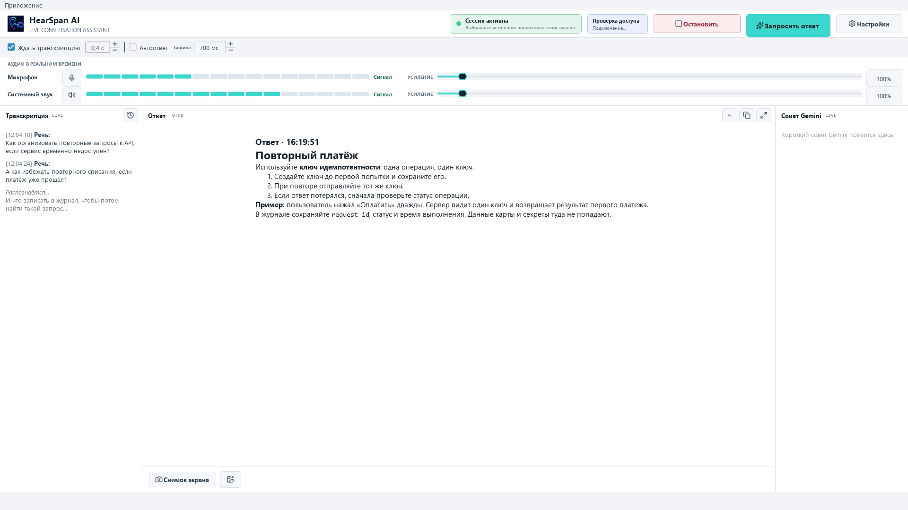
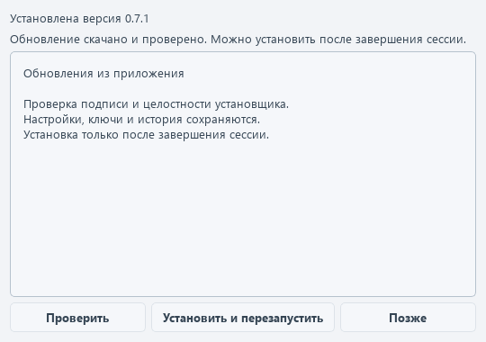
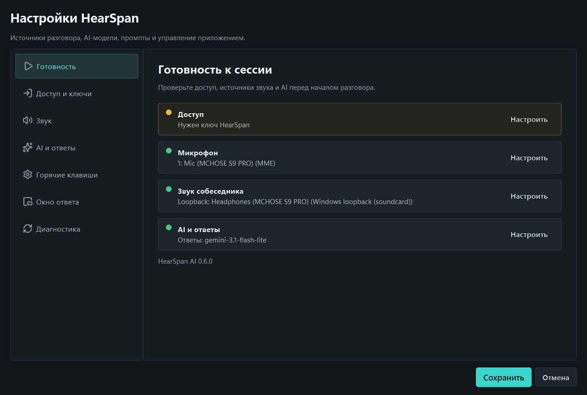
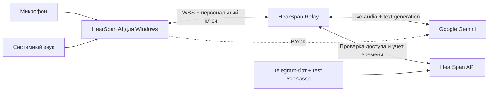
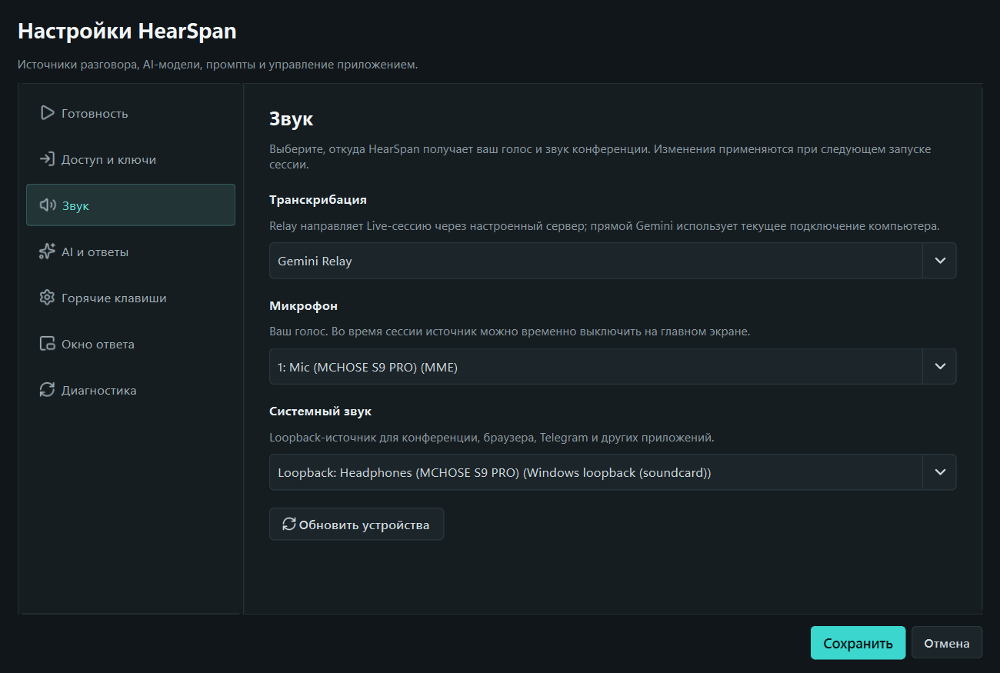

  
  
<strong>Hear the whole conversation. Answer with context.</strong>

  
Windows-ассистент Никиты для транскрибации разговоров и быстрых ответов с учётом контекста.

  

    
    
    
    
  

  

    <a href="https://github.com/NNFall/HearSpanAI/releases/latest"><strong>Скачать последнюю версию</strong></a>
    ·
    <a href="https://hearspan-ai.ru/">Сайт</a>
    ·
    <a href="https://t.me/HearSpan_bot?start=github">Telegram-бот</a>
    ·
    <a href="ROADMAP.md">Планы</a>
    ·
    <a href="CHANGELOG.md">История версий</a>
  

> [!IMPORTANT]
> Актуальный Windows-релиз: `v0.8.1`. Метаданные обновления подписаны; сертификата Windows Authenticode пока нет, поэтому предупреждение SmartScreen возможно. YooKassa работает только в тестовом режиме: реальные списания отключены. Прочитайте [изменения 0.8.1](docs/releases/v0.8.1.md), [приватность](PRIVACY.md) и [безопасность](SECURITY.md).

## Обновление 0.8.1

- Если ключ HearSpan истёк, приложение явно покажет причину и подскажет, где вставить действующий ключ.
- При ошибке текстового запроса приложение сразу получает её от relay: повторяет запрос или показывает итоговую ошибку без лишнего ожидания.
- При `503` Google relay быстрее переключается на запасную текстовую модель.
- Новые установки подключаются через `hearspan-ai.ru`; прежние адреса сохранены для уже установленных клиентов.

[Подробности выпуска 0.8.1](docs/releases/v0.8.1.md).

## Статус 0.8.0

- Полный набор проверок: `1510` пройдено, `4` пропущено, `0` ошибок.
- Запуск EXE и сохранение пользовательских данных при установке проверены успешно.
- Установщик `HearSpan-Setup-0.8.0.exe`: `90,517,754` байта; SHA-256:
  `d08cad0248c4c04bf011df3f10ae0772fc5b9b61e4a3c41aba0d1b0ad07fad14`.
- Числовая задержка Gemini Live не заявляется.

## Новое В 0.8.0

- **Ожидание снимка контекста:** после нажатия **Запросить ответ** приложение
  по умолчанию ждёт `0.4` секунды перед сбором текущего контекста. Настройка —
  от `0` до `3` секунд или полное отключение. Финальная транскрипция может ещё
  не прийти: тогда в снимок попадает доступная промежуточная транскрипция.
- **Автоматические ответы:** выключены по умолчанию. Отдельная пауза после
  финальной транскрипции составляет `700` мс и настраивается в диапазоне
  `300–3000` мс; она не определяется по тишине или громкости звука.
- **Защита от дублей:** одновременно выполняется только один автоматический
  запрос, а поздняя финализация и ручной запрос не создают второй ответ на ту
  же реплику.
- **Постепенный вывод текстового ответа:** существующий вывод ответа частями
  сохраняется.
- **Обновление без потери данных:** локальная история и пользовательские
  настройки сохраняются, установка по-прежнему требует подтверждения.

Подробности выпуска: [примечания к выпуску 0.8.0](docs/releases/v0.8.0.md).

## Новое В 0.7.1

- **Обновления из приложения:** проверка версии в фоне, скачивание и установка по подтверждению. Во время сессии установка заблокирована.
- **История разговоров:** локальный архив, поиск, просмотр и экспорт Markdown.
- **Изображения в вопросе:** снимок выбранного монитора или PNG/JPEG, предпросмотр перед отправкой.
- Светлая тема, более читаемая транскрипция и защита настроек от случайного изменения колёсиком.
- Сжатие старого контекста в Relay с сохранением промптов и последних вопросов.

Обновить старую версию нужно один раз новым установщиком, **без удаления приложения**.
После этого новые выпуски доступны через **Приложение → Обновления**.
Настройки, ключи и история сохраняются.

## Что такое HearSpan AI

HearSpan AI одновременно слышит микрофон и системный звук Windows, отправляет небольшие аудиофрагменты в Gemini Live и показывает транскрипцию ещё во время длинной реплики. По команде приложение дожидается последних фрагментов речи и потоково выводит структурированный Markdown-ответ с учётом разговора.

Приложение подходит для встреч, обучения, консультаций и технических собеседований. Используйте запись только с необходимым согласием участников и в рамках правил встречи и законодательства вашей страны.

## Что появилось в 0.6.0

- экран готовности с проверкой доступа, микрофона, системного звука и AI-модели;
- семь понятных разделов настроек вместо длинного технического списка;
- состояния аудио `Сигнал`, `Тишина`, `Выкл.` и `Перегруз`;
- отдельный прогресс запроса без потери статуса активной записи;
- вкладки ответа и live-совета на компактном экране;
- безопасный диагностический отчёт без ключей и relay-токенов;
- короткое меню Telegram-бота с четырьмя основными действиями;
- явная маркировка тестовой оплаты YooKassa на каждом экране checkout;
- полупрозрачный Answer Overlay с исключением из поддерживаемого Windows-захвата;
- автоматический 10-минутный trial для новой установки;
- персональные ключи HearSpan с остатком доступного времени;
- защищённое WSS-соединение и серверная проверка доступа до запуска Gemini;
- потоковый Markdown-ответ с учётом накопленного контекста.

## Быстрый старт

1. Скачайте актуальный установщик со страницы [официального релиза](https://github.com/NNFall/HearSpanAI/releases/latest).
2. Запустите стандартный мастер установки. Python не требуется.
3. При первом открытии дождитесь автоматической активации 10-минутного trial.
4. Откройте **Настройки → Готовность** и устраните отмеченные пункты; устройства выбираются в разделе **Звук**.
5. Начните сессию и проверьте движение обоих индикаторов громкости.
6. После вопроса нажмите **Запросить ответ** или `Ctrl+Enter`.
7. После trial получите персональный ключ в [Telegram-боте](https://t.me/HearSpan_bot?start=github) и вставьте его в **Настройки → Доступ и ключи**.

Подробности: [установка](docs/installation.md), [конфигурация](docs/configuration.md) и [диагностика](docs/troubleshooting.md).

## Приватность Answer Overlay

В **Настройки → Окно ответа** можно включить отдельное окно ответа, настроить его
прозрачность и оставить активным переключатель **Не показывать overlay в
демонстрации экрана**. Зелёный значок с глазом означает, что Windows приняла
защиту для этого окна.

Функция использует `WDA_EXCLUDEFROMCAPTURE` и требует Windows 10 версии 2004
или новее. Она защищает только Answer Overlay: главное окно и настройки
остаются видимыми. Результат зависит от способа захвата, поэтому перед важной
демонстрацией проверьте функцию в используемой программе. Это не скрытие
процесса и не универсальная гарантия для всех программ записи.

## Режимы доступа

| Режим | Что требуется | Куда идут запросы |
| --- | --- | --- |
| HearSpan Relay | trial или персональный ключ HearSpan | через защищённый relay проекта в Gemini |
| BYOK | собственный Gemini API key | напрямую с компьютера пользователя в Gemini |

Тестовая витрина Telegram показывает два плана: Start — 180 минут за 500 ₽ и Pro — 900 минут за 1 500 ₽ на 30 дней. Пока включён обязательный test mode YooKassa, это демонстрация платёжного сценария без реальных списаний.

## Как устроено

Публичное описание компонентов находится в [docs/architecture.md](docs/architecture.md). Исходный код desktop-клиента, relay и control plane хранится отдельно и не публикуется в этом репозитории.

## Данные и безопасность

- клиент подключается к relay по `wss://`;
- публичный прямой TCP-порт relay закрыт;
- ключ HearSpan и сохранённый BYOK-ключ защищаются Windows DPAPI;
- серверная база не хранит транскрипции, промпты и ответы;
- локальный диагностический лог может содержать текст разговора и ответ модели;
- секреты инфраструктуры не входят в установщик и публичный репозиторий.

Перед отправкой лога удалите транскрипцию, персональные данные и любые ключи.

## Проверка релиза

- полный набор проверок 0.8.0: `1510 passed, 4 skipped, 0 failed`;
- запуск EXE и сохранение пользовательских данных при установке: пройдено;
- установщик `0.8.0` подписан и проверен по SHA-256;
- реальный путь `trial → WSS → Gemini Live → 5 секунд metering → close` проверен;
- установщик прошёл автономный запуск, тихое обновление и проверку SHA-256;
- реальный Windows screenshot probe увидел `90 000` контрольных пикселей до защиты и `0` после неё;
- упакованный EXE применил affinity `0x11` только к Answer Overlay;
- интерфейс проверен от `960x640` до `1920x1080`.

## Репозиторий

Здесь публикуются пользовательская документация, бренд-материалы, скриншоты, история версий и проверенные установщики. Исходный код приложения и серверной части закрыт.

Автор и разработчик: [Никита / NNFall](https://github.com/NNFall). Ошибки и предложения принимаются через [Issues](https://github.com/NNFall/HearSpanAI/issues); уязвимости — только по инструкции из [SECURITY.md](SECURITY.md).
