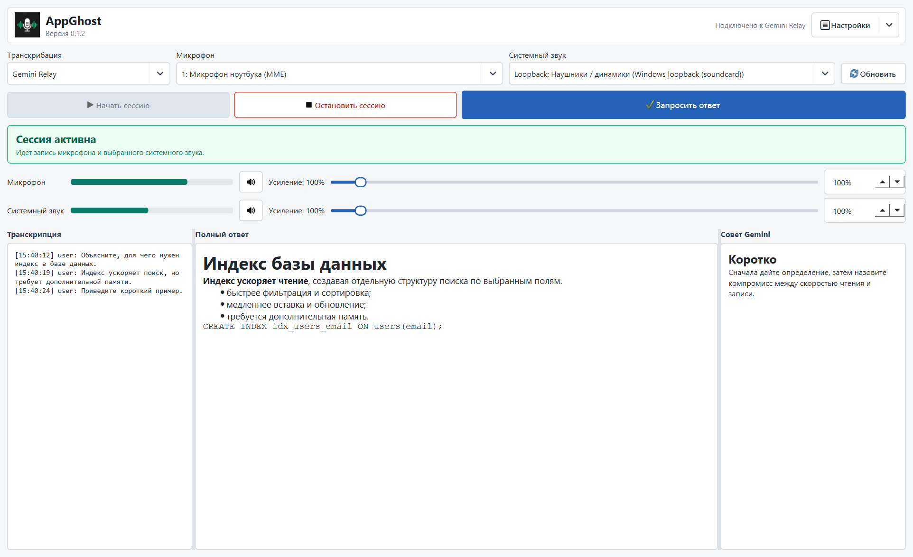
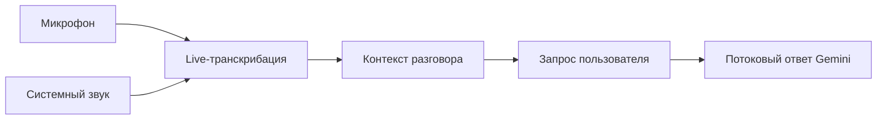

  
  
<strong>Hear the whole conversation. Answer with context.</strong>

  
AI-ассистент Никиты для транскрибации разговоров и быстрых ответов в реальном времени.

  

    
    
    
    
  

  

    <a href="ROADMAP.md"><strong>Планы разработки</strong></a>
    ·
    <a href="WORKLOG.md">Журнал работ</a>
    ·
    <a href="CHANGELOG.md">История версий</a>
    ·
    <a href="https://github.com/NNFall/HearSpanAI/issues">Обратная связь</a>
  

> [!IMPORTANT]
> HearSpan AI находится в активной переработке интерфейса и инфраструктуры. Публичный установщик появится после ребрендинга приложения и обязательной защиты relay-сервера. Историческая версия `0.1.2` выпускалась под рабочим названием **AppGhost** и публично не распространяется.

## Что такое HearSpan AI

HearSpan AI слышит микрофон и системный звук Windows, транскрибирует разговор в реальном времени, удерживает контекст и по запросу показывает короткий структурированный ответ Gemini.

Приложение рассчитано на встречи, обучение, консультации, технические собеседования и другие ситуации, где важно не потерять содержание длинного разговора. Использование записи должно соответствовать правилам встречи и законодательству вашей страны.

## Как это работает

- два независимых аудиоисточника с индикаторами громкости;
- транскрибация через постоянное WebSocket-соединение;
- ожидание последних фрагментов речи перед ручным запросом;
- потоковый Markdown-ответ в отдельной области;
- настраиваемые промпты, усиление, mute и горячие клавиши;
- локальные настройки и диагностические логи.

## Текущий статус

| Компонент | Статус |
| --- | --- |
| Windows-прототип | Проверен на Windows 10/11, включая ноутбук без Python |
| Микрофон и Windows loopback | Работают в одной сессии |
| Gemini Live и потоковый текстовый ответ | Работают через private beta relay |
| Новый бренд HearSpan AI | Выбран, перенос в приложение запланирован |
| Публичный установщик | Приостановлен до защиты relay и ребрендинга |
| Собственный Gemini API-ключ | Поддержка через безопасные настройки запланирована |
| Android | Исследование после стабилизации Windows-версии |

Подробности: [ROADMAP.md](ROADMAP.md) и [WORKLOG.md](WORKLOG.md).

## Будущая установка

Первый публичный установщик будет опубликован только в разделе [Releases](https://github.com/NNFall/HearSpanAI/releases). Python на компьютере пользователя не потребуется. До появления такого релиза файлы, опубликованные от имени HearSpan AI на сторонних сайтах, не считаются официальными.

Планируемая конфигурация:

1. работа через защищенный relay проекта;
2. альтернативный прямой режим с собственным Gemini API-ключом;
3. хранение ключей только локально, без добавления их в Git или диагностические отчеты.

Безопасный шаблон переменных находится в [.env.example](.env.example). Реальные значения никогда не должны публиковаться.

## Стоимость

API-запросы Gemini тарифицируются Google. Ориентир по токенам, минутам аудио и рублям приведен в [docs/costs.md](docs/costs.md). Цена зависит от модели, длины сессии, накопленного контекста, тарифа Google и курса валют.

## Данные и приватность

В beta-архитектуре аудио, транскрипция и контекст могут передаваться через relay проекта в Google Gemini. Диагностический лог хранится локально и может содержать текст разговора. Не используйте тестовые сборки для конфиденциальных данных.

Перед использованием прочитайте [PRIVACY.md](PRIVACY.md) и [SECURITY.md](SECURITY.md).

## Репозиторий и лицензия

Это публичный репозиторий продукта: здесь публикуются документация, изображения, журнал разработки, история версий, задачи и проверенные установщики. Исходный код приложения и серверной части не публикуется.

Автор и разработчик: [Никита / NNFall](https://github.com/NNFall). Условия использования материалов описаны в [LICENSE.md](LICENSE.md).
