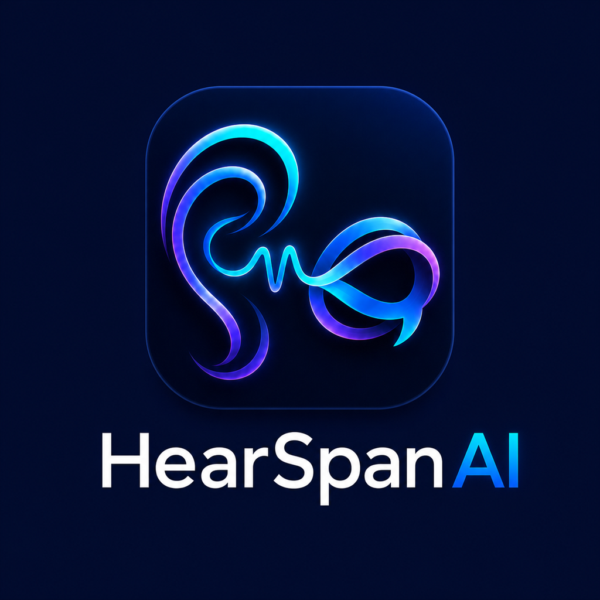
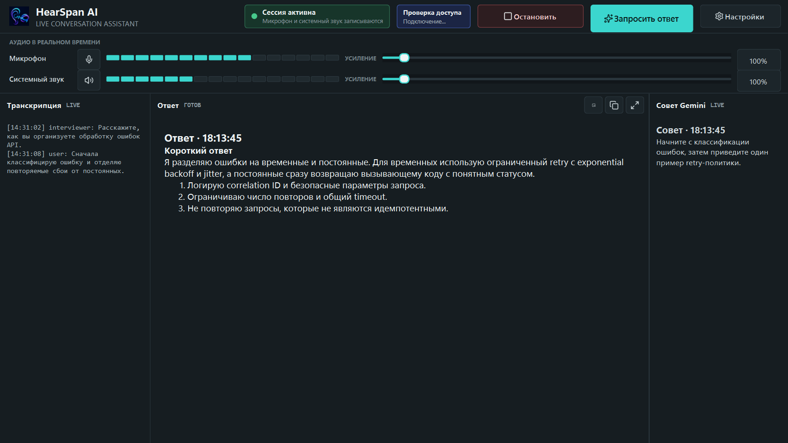
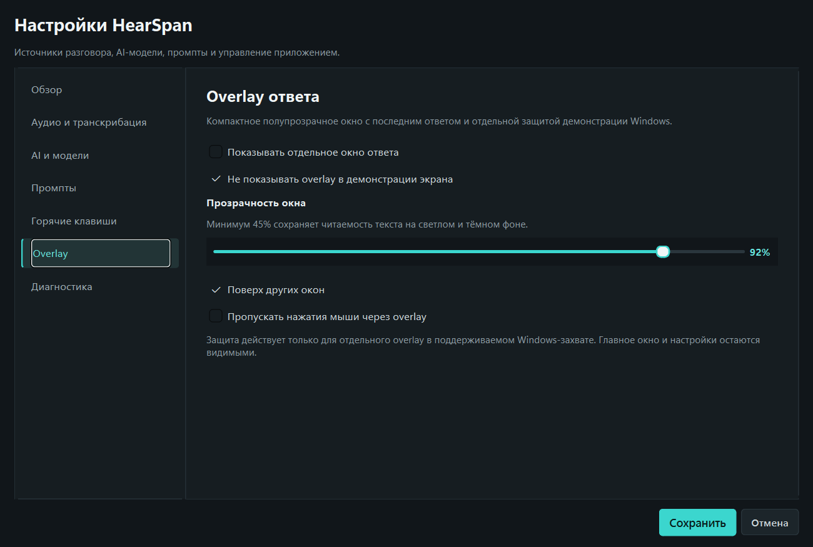
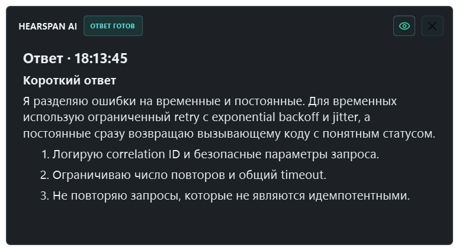
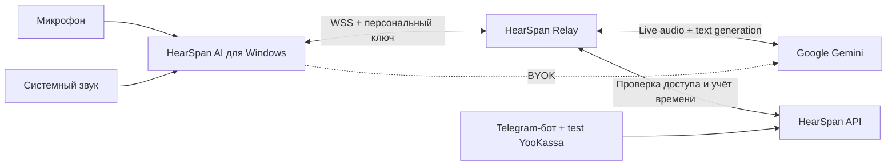
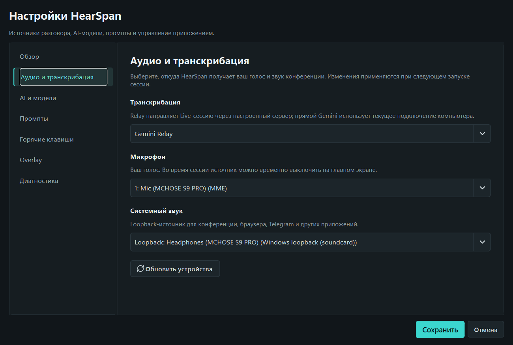

  
  
<strong>Hear the whole conversation. Answer with context.</strong>

  
Windows-ассистент Никиты для транскрибации разговоров и быстрых ответов с учётом контекста.

  

    
    
    
    
  

  

    <a href="https://github.com/NNFall/HearSpanAI/releases/tag/v0.5.0"><strong>Скачать v0.5.0</strong></a>
    ·
    <a href="https://kaigo.space/hearspan-ai/">Сайт</a>
    ·
    <a href="https://t.me/HearSpan_bot?start=github">Telegram-бот</a>
    ·
    <a href="ROADMAP.md">Планы</a>
    ·
    <a href="CHANGELOG.md">История версий</a>
  

> [!IMPORTANT]
> `v0.5.0` — неподписанная Windows private beta. YooKassa работает только в тестовом режиме: реальные списания отключены. Перед установкой прочитайте [ограничения релиза](docs/releases/v0.5.0.md), [приватность](PRIVACY.md) и [безопасность](SECURITY.md).

## Что такое HearSpan AI

HearSpan AI одновременно слышит микрофон и системный звук Windows, отправляет небольшие аудиофрагменты в Gemini Live и показывает транскрипцию ещё во время длинной реплики. По команде приложение дожидается последних фрагментов речи и потоково выводит структурированный Markdown-ответ с учётом разговора.

Приложение подходит для встреч, обучения, консультаций и технических собеседований. Используйте запись только с необходимым согласием участников и в рамках правил встречи и законодательства вашей страны.

## Что появилось в 0.5.0

- полупрозрачный Answer Overlay с прозрачностью от 45% до 100%;
- исключение отдельного overlay из поддерживаемого Windows-захвата;
- локальный индикатор состояния защиты демонстрации;
- сохранение настройки и повторное применение после изменения режима окна;
- автоматический 10-минутный trial для новой установки;
- персональные ключи HearSpan с остатком доступного времени;
- получение ключа, профиль, тарифы и поддержка через `@HearSpan_bot`;
- защищённое WSS-соединение и серверная проверка доступа до запуска Gemini;
- посекундный учёт активной подключённой сессии;
- режим BYOK с собственным Gemini API key;
- сохранение ключей через Windows DPAPI;
- отдельные панели транскрипции, ответа и live-совета;
- потоковый Markdown-ответ с учётом накопленного контекста.

## Быстрый старт

1. Скачайте `HearSpan-Setup-0.5.0.exe` со страницы [официального релиза](https://github.com/NNFall/HearSpanAI/releases/tag/v0.5.0).
2. Запустите стандартный мастер установки. Python не требуется.
3. При первом открытии дождитесь автоматической активации 10-минутного trial.
4. В **Настройки → Аудио и транскрибация** выберите микрофон и устройство, через которое слышен системный звук.
5. Начните сессию и проверьте движение обоих индикаторов громкости.
6. После вопроса нажмите **Запросить ответ** или `Ctrl+Enter`.
7. После trial получите персональный ключ в [Telegram-боте](https://t.me/HearSpan_bot?start=github) и вставьте его в **Настройки → Обзор**.

Подробности: [установка](docs/installation.md), [конфигурация](docs/configuration.md) и [диагностика](docs/troubleshooting.md).

## Приватность Answer Overlay

В **Настройки → Overlay** можно включить отдельное окно ответа, настроить его
прозрачность и оставить активным переключатель **Не показывать overlay в
демонстрации экрана**. Зелёный значок с глазом означает, что Windows приняла
защиту для этого окна.

Функция использует `WDA_EXCLUDEFROMCAPTURE` и требует Windows 10 версии 2004
или новее. Она защищает только Answer Overlay: главное окно и настройки
остаются видимыми. Результат зависит от способа захвата, поэтому перед важной
демонстрацией проверьте функцию в используемой программе. Это не скрытие
процесса и не универсальная гарантия для всех программ записи.

## Режимы доступа

| Режим | Что требуется | Куда идут запросы |
| --- | --- | --- |
| HearSpan Relay | trial или персональный ключ HearSpan | через защищённый relay проекта в Gemini |
| BYOK | собственный Gemini API key | напрямую с компьютера пользователя в Gemini |

Тестовая витрина Telegram показывает два плана: Start — 180 минут за 500 ₽ и Pro — 900 минут за 1 500 ₽ на 30 дней. Пока включён обязательный test mode YooKassa, это демонстрация платёжного сценария без реальных списаний.

## Как устроено

Публичное описание компонентов находится в [docs/architecture.md](docs/architecture.md). Исходный код desktop-клиента, relay и control plane хранится отдельно и не публикуется в этом репозитории.

## Данные и безопасность

- клиент подключается к relay по `wss://`;
- публичный прямой TCP-порт relay закрыт;
- ключ HearSpan и сохранённый BYOK-ключ защищаются Windows DPAPI;
- серверная база не хранит транскрипции, промпты и ответы;
- локальный диагностический лог может содержать текст разговора и ответ модели;
- секреты инфраструктуры не входят в установщик и публичный репозиторий.

Перед отправкой лога удалите транскрипцию, персональные данные и любые ключи.

## Проверка релиза

- desktop/relay: `253 passed, 1 skipped`;
- control plane: `782 passed, 3 skipped`;
- website: `35 passed`, browser E2E: `15 passed`;
- реальный путь `trial → WSS → Gemini Live → 5 секунд metering → close` проверен;
- установщик прошёл автономный запуск, тихое обновление и проверку SHA-256;
- реальный Windows screenshot probe увидел `90 000` контрольных пикселей до защиты и `0` после неё;
- упакованный EXE применил affinity `0x11` только к Answer Overlay;
- интерфейс проверен от `960x640` до `1920x1080`.

## Репозиторий

Здесь публикуются пользовательская документация, бренд-материалы, скриншоты, история версий и проверенные установщики. Исходный код приложения и серверной части закрыт.

Автор и разработчик: [Никита / NNFall](https://github.com/NNFall). Ошибки и предложения принимаются через [Issues](https://github.com/NNFall/HearSpanAI/issues); уязвимости — только по инструкции из [SECURITY.md](SECURITY.md).
