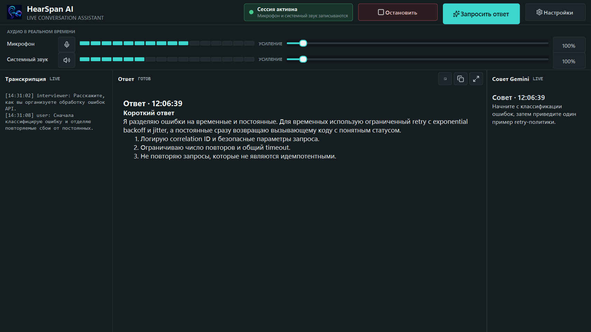
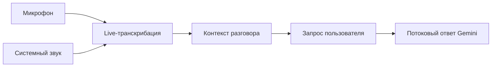
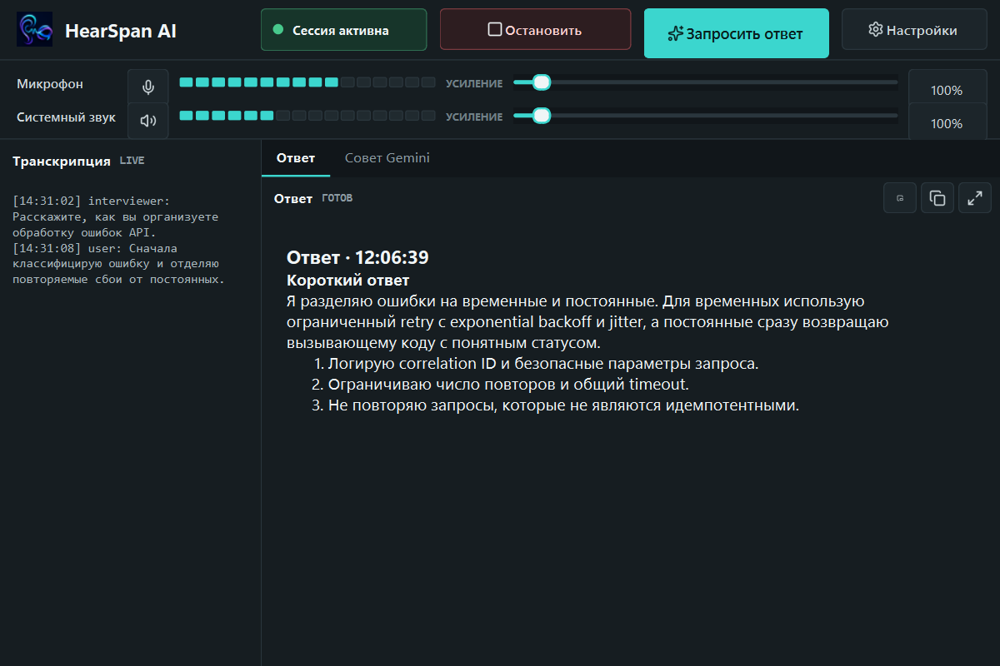
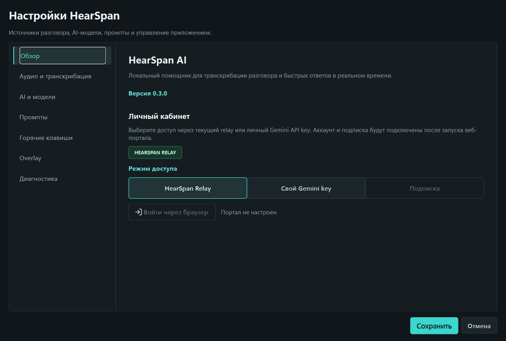

  
  
<strong>Hear the whole conversation. Answer with context.</strong>

  
AI-ассистент Никиты для транскрибации разговоров и быстрых ответов в реальном времени.

  

    
    
    
    
  

  

    <a href="https://github.com/NNFall/HearSpanAI/releases/tag/v0.3.0"><strong>Скачать v0.3.0</strong></a>
    ·
    <a href="ROADMAP.md">Планы разработки</a>
    ·
    <a href="WORKLOG.md">Журнал работ</a>
    ·
    <a href="CHANGELOG.md">История версий</a>
    ·
    <a href="https://github.com/NNFall/HearSpanAI/issues">Обратная связь</a>
  

> [!IMPORTANT]
> HearSpan AI `0.3.0` доступен как неподписанная Windows private beta. Relay-инфраструктура пока не рассчитана на конфиденциальные разговоры или публичную нагрузку: перед установкой прочитайте [ограничения релиза](docs/releases/v0.3.0.md) и [политику безопасности](SECURITY.md).

## Что такое HearSpan AI

HearSpan AI слышит микрофон и системный звук Windows, транскрибирует разговор в реальном времени, удерживает контекст и по запросу показывает короткий структурированный ответ Gemini.

Приложение рассчитано на встречи, обучение, консультации, технические собеседования и другие ситуации, где важно не потерять содержание длинного разговора. Использование записи должно соответствовать правилам встречи и законодательству вашей страны.

## Как это работает

- два независимых аудиоисточника с индикаторами громкости;
- транскрибация через постоянное WebSocket-соединение;
- ожидание последних фрагментов речи перед ручным запросом;
- потоковый Markdown-ответ в отдельной области;
- защищённое сохранение личного Gemini API key через Windows DPAPI;
- отдельный capture-visible overlay ответа с прозрачностью и always-on-top;
- настраиваемые промпты, усиление, mute и горячие клавиши;
- локальные настройки и диагностические логи.

## Текущий статус

| Компонент | Статус |
| --- | --- |
| Windows-прототип | Проверен на Windows 10/11, включая ноутбук без Python |
| Микрофон и Windows loopback | Работают в одной сессии |
| Gemini Live и потоковый текстовый ответ | Работают через private beta relay |
| Новый бренд и адаптивный интерфейс HearSpan AI | Реализованы в `0.3.0` |
| Windows-установщик | Доступен как неподписанная private beta |
| Собственный Gemini API-ключ | Работает напрямую; опционально хранится в DPAPI для текущего пользователя Windows |
| Android | Исследование после стабилизации Windows-версии |

Подробности: [ROADMAP.md](ROADMAP.md) и [WORKLOG.md](WORKLOG.md).

## Установка

Скачайте `HearSpan-Setup-0.3.0.exe` только со страницы [официального релиза](https://github.com/NNFall/HearSpanAI/releases/tag/v0.3.0). Python на компьютере пользователя не требуется. Установщик создает ярлыки в меню «Пуск» и, по выбору пользователя, на рабочем столе.

Текущая конфигурация:

1. основной режим работает через beta relay проекта;
2. прямой режим Gemini предназначен для владельца собственного API-ключа;
3. настройки и логи сохраняются локально и совместимы с предыдущей beta AppGhost.

Безопасный шаблон переменных находится в [.env.example](.env.example). Реальные значения никогда не должны публиковаться.

## Стоимость

API-запросы Gemini тарифицируются Google. Ориентир по токенам, минутам аудио и рублям приведен в [docs/costs.md](docs/costs.md). Цена зависит от модели, длины сессии, накопленного контекста, тарифа Google и курса валют.

## Данные и приватность

В beta-архитектуре аудио, транскрипция и контекст могут передаваться через relay проекта в Google Gemini. Диагностический лог хранится локально и может содержать текст разговора. Не используйте тестовые сборки для конфиденциальных данных.

Перед использованием прочитайте [PRIVACY.md](PRIVACY.md) и [SECURITY.md](SECURITY.md).

## Репозиторий и лицензия

Это публичный репозиторий продукта: здесь публикуются документация, изображения, журнал разработки, история версий, задачи и проверенные установщики. Исходный код приложения и серверной части не публикуется.

Автор и разработчик: [Никита / NNFall](https://github.com/NNFall). Условия использования материалов описаны в [LICENSE.md](LICENSE.md).
