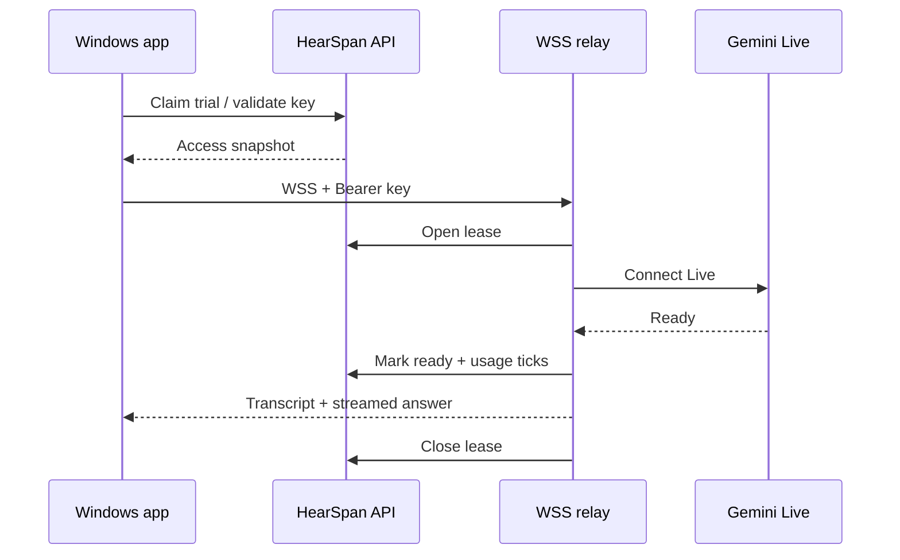

# Архитектура продукта

Это пользовательское описание без исходного кода, IP-адресов и внутренних параметров инфраструктуры.

## Аудиопоток и Live-транскрибация

HearSpan AI захватывает микрофон и Windows loopback как независимые источники. Небольшие аудиочанки постоянно идут по WSS в relay, поэтому транскрипция может появляться до окончания длинной реплики. Relay подключается к Gemini Live из поддерживаемого региона и возвращает события приложению.

## Доступ и учёт времени

Новая установка запрашивает один 10-минутный trial у HearSpan API. После trial пользователь получает персональный ключ в Telegram-боте. Relay открывает lease и проверяет ключ до подключения к Gemini; списание начинается только после события готовности Live-сессии и прекращается при её закрытии.

## Полный ответ

После нажатия **Запросить ответ** приложение кратко ждёт последние фрагменты транскрипции. Затем relay формирует отдельный текстовый запрос из пользовательского промпта, объединённой истории разговора и предыдущих полных ответов. Gemini возвращает ответ потоково, а клиент отображает Markdown по мере генерации.

## Telegram и тестовая оплата

Telegram-бот показывает профиль, тарифы, остаток времени, ключи и поддержку. YooKassa в `0.4.0` принудительно работает в test mode. После подтверждённого provider-события control plane идемпотентно меняет подписку; неподтверждённый webhook сам по себе не выдаёт минуты.

## Данные

Локально сохраняются настройки, DPAPI-зашифрованные ключи и диагностический лог. Серверная база содержит только технические записи доступа, metering, Telegram и платёжных статусов; транскрипции, промпты и ответы в неё не записываются.

## Граница публичного репозитория

Здесь находятся только пользовательская документация, бренд-материалы, скриншоты и release assets. Исходный код Windows-приложения, relay, control plane и deployment-конфигурация хранятся отдельно.
