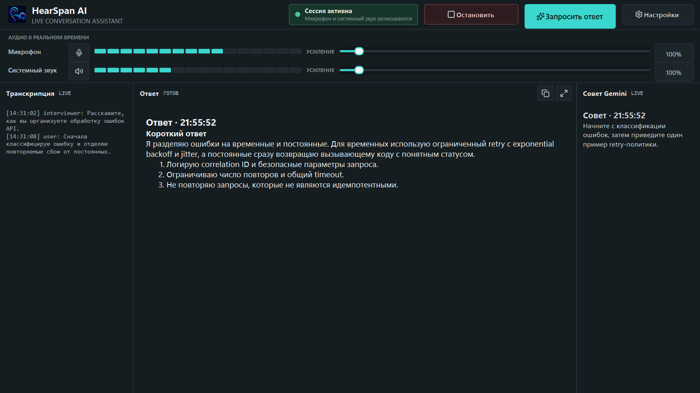
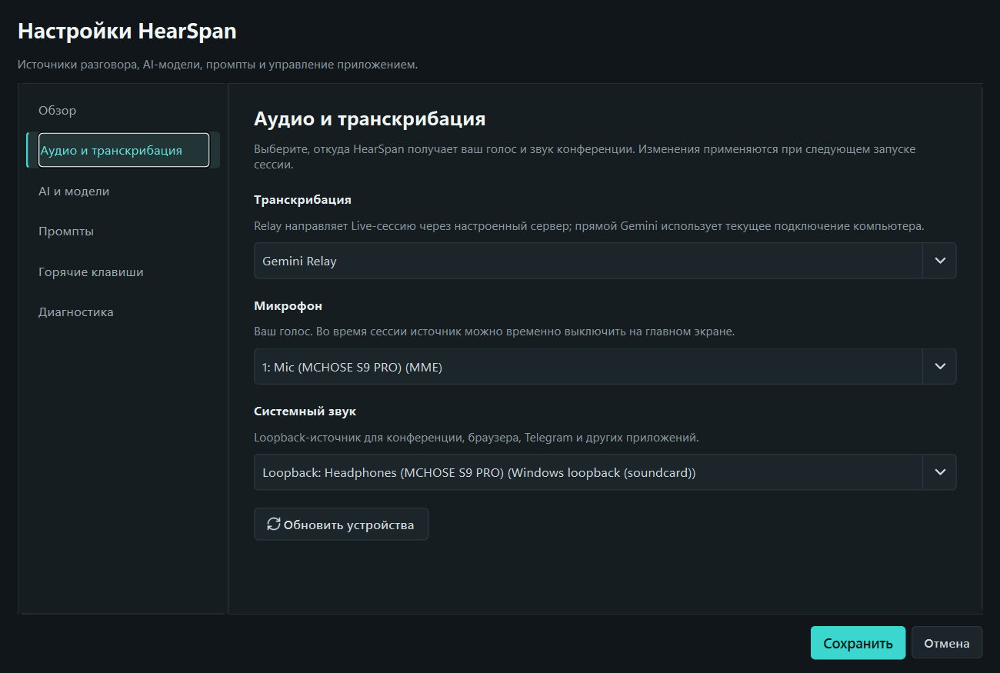

# HearSpan AI v0.2.1

`v0.2.1` — private beta с отдельным окном настроек и упрощённым живым экраном.

## Скачать

- `HearSpan-Setup-0.2.1.exe`
- размер: `76.35 MiB` (`80 057 777` байт)
- SHA-256: `9273e953e2f574d4ffc6f48e11c56b3f1a75c2d0d34b15adb1f5253294643aaa`
- контрольная сумма также приложена как `SHA256SUMS.txt`.

## Изменения

- настройки открываются напрямую в отдельном окне;
- выбор транскрибации, микрофона и системного loopback перенесён в раздел аудио;
- добавлены обзор, AI-модели, промпты, горячие клавиши и диагностика;
- Live-модель и модель ответа сохраняются между запусками;
- введённый API-ключ работает только до закрытия приложения и не записывается в локальные настройки;
- основной экран оставляет только управление живой сессией и ответом;
- исправлены перекрывающиеся стрелки у полей усиления.

## Проверка

- `126 passed`;
- `HearSpan.exe` имеет `ProductVersion` и `FileVersion` `0.2.1`;
- packaged smoke-test подтвердил запуск без Python и создание локального лога;
- опубликованные скриншоты не содержат ключей, токенов или внутренних endpoint.

## Ограничения private beta

Установщик не подписан цифровой подписью, поэтому SmartScreen может показать предупреждение. Общий relay остаётся тестовой инфраструктурой и не предназначен для конфиденциальных разговоров или публичной нагрузки.
