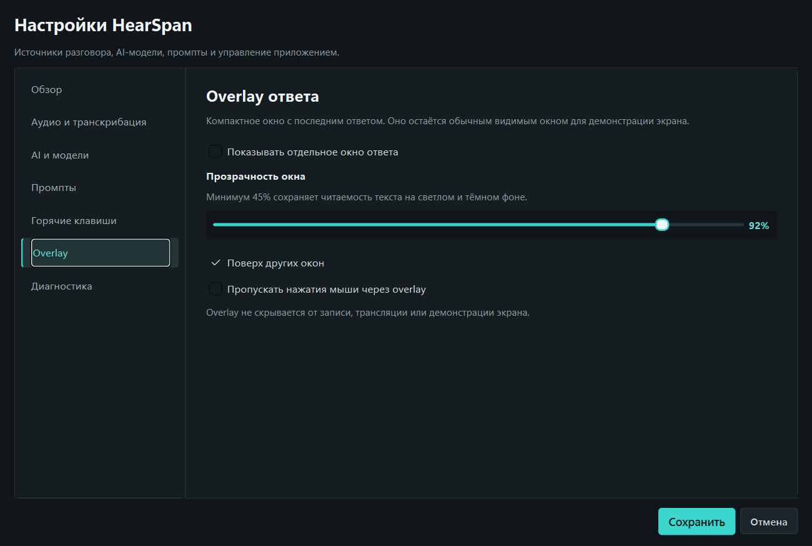
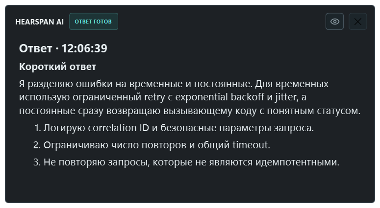

# HearSpan AI v0.3.0

`v0.3.0` — private beta с защищённым BYOK и отдельным окном потокового ответа.

## Скачать

- `HearSpan-Setup-0.3.0.exe`
- размер: `76.36 MiB` (`80 065 975` байт)
- SHA-256: `FB2B21B57E60A0DB1F30AA357039F30D3F38AE091B1C04C71A81CBADB4EC9381`
- контрольная сумма также приложена как `SHA256SUMS.txt`.

## Изменения

- выбор между текущим HearSpan Relay и личным Gemini API key;
- опциональное DPAPI-хранилище ключа без открытого секрета в `settings.json`;
- отдельный overlay потокового Markdown-ответа;
- настройки прозрачности, always-on-top и пропуска мыши;
- сохранение положения overlay между запусками;
- заготовка входа через внешний браузер для будущего личного кабинета.

## Проверка

- `149 passed, 1 skipped`;
- `HearSpan.exe` и установщик имеют версию `0.3.0`;
- packaged smoke-test подтвердил автономный запуск и создание лога;
- исходники и публичные материалы проверены на секреты.

## Ограничения private beta

- установщик пока не подписан цифровой подписью, поэтому SmartScreen может показать предупреждение;
- общий relay остаётся тестовой инфраструктурой без TLS и не предназначен для конфиденциальных разговоров;
- вход и подписка ещё не активны: для них нужны веб-портал, OAuth/PKCE и entitlement API;
- overlay является обычным видимым окном и не скрывается от записи или демонстрации экрана.
