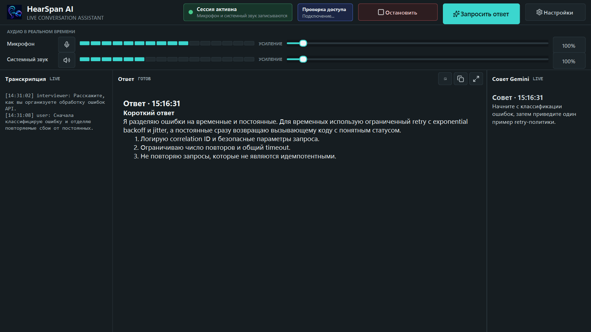
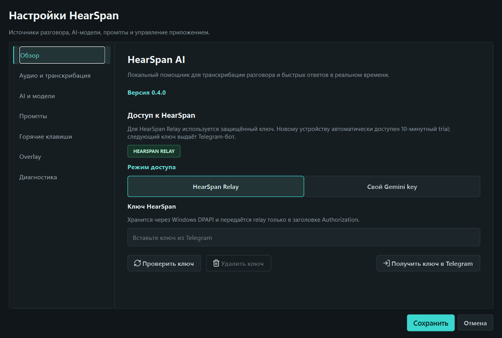
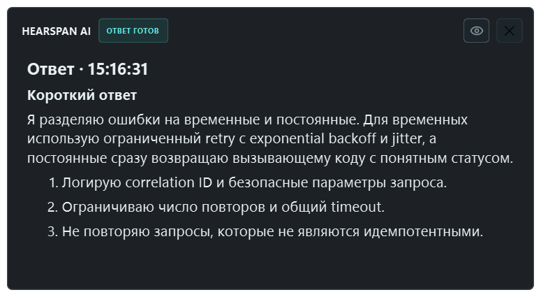

# HearSpan AI v0.4.0

`v0.4.0` объединяет Windows-клиент, защищённый relay, автоматический trial,
персональные ключи, Telegram-бот и тестовый платёжный контур.

## Скачать

- установщик: `HearSpan-Setup-0.4.0.exe`;
- Windows 10/11 x64;
- Python не требуется;
- размер: `80 099 077` байт;
- SHA-256: `345045ECE09C30D414590999C22523A9E4F5BBF023AAAD817A45C87887D09832`.

Контрольная сумма также приложена как `SHA256SUMS.txt`.

## Что добавлено

- 10 минут бесплатной сессии для новой установки;
- персональный ключ HearSpan с остатком времени и проверкой в приложении;
- Telegram-бот `@HearSpan_bot` с профилем, тарифами, ключами и поддержкой;
- тестовая YooKassa с отдельным согласием на автопродление;
- защищённый WSS relay с серверной авторизацией и metering;
- публичный лендинг, условия, приватность и поддержка.

## Как списывается время

Relay сначала проверяет ключ и открывает lease. Списание начинается только после готовности Gemini Live и останавливается при завершении сессии. Тишина внутри активной подключённой сессии также считается временем использования.

## Безопасность

- клиент подключается по `wss://`;
- прямой публичный TCP-порт relay закрыт;
- ключи защищаются Windows DPAPI;
- provider-секреты не входят в EXE и репозиторий;
- серверная база не хранит транскрипции, промпты и ответы;
- release-файлы прошли secret scan.

## Проверка

- desktop/relay: `237 passed, 1 skipped`;
- control plane: `782 passed, 3 skipped`;
- website: `35 passed`, browser E2E: `15 passed`;
- реальный путь `trial → Gemini Live → 5 секунд metering → close` прошёл через публичный WSS;
- PostgreSQL backup восстановлен в одноразовую БД с совпавшими migration и counts;
- EXE прошёл автономный smoke, а тихое обновление сохранило пользовательские настройки;
- интерфейс проверен от `960x640` до `1920x1080`.

## Ограничения beta

- YooKassa принудительно работает в test mode, реальные списания отключены;
- webhook и recurring-сценарий требуют финальной ручной проверки в кабинете;
- установщик не подписан цифровой подписью;
- loopback зависит от драйвера и выбранного устройства вывода;
- локальный лог может содержать разговор и ответы.
